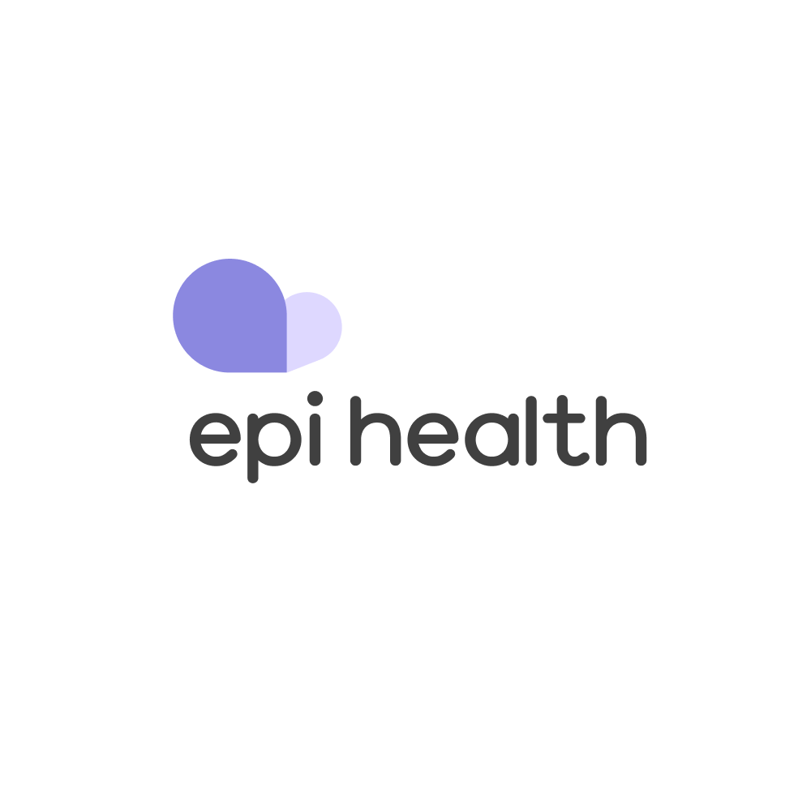

Epilepsy is a neurological disorder in which brain activity becomes abnormal resulting in seizures. Seizures typically involve involontary movements and loss of conciousness. Epilepsy affects around 50 million people worldwide, making it one of the most common neurological disorders. The risk of premature death associated with Epilepsy is three times higher than that of the general population. 

Epilepsy is diagnosed using EEG tests, MRI and CT scans, or blood and neurological tests. These tests can be very invasive and require extended time to be spent at a hospital or medical clinic. For our AI4Good lab project, our group decided to create an app that uses machine learning to predict and decect seizures using biometrics gathered from wearable devices such as apple watches and fitbits. Our app aims to improve the lives of people with Epilepsy by giving them a way to manage their condition through their phone.   

# EpiHealthML

EpiHealth is a seizure prediction and detection app that uses AI and biometric data from wearable wrist devices to give people with epilepsy autonomy over their condition. Additional metrics such as stress levels are monitored to keep users aware of their triggers.

